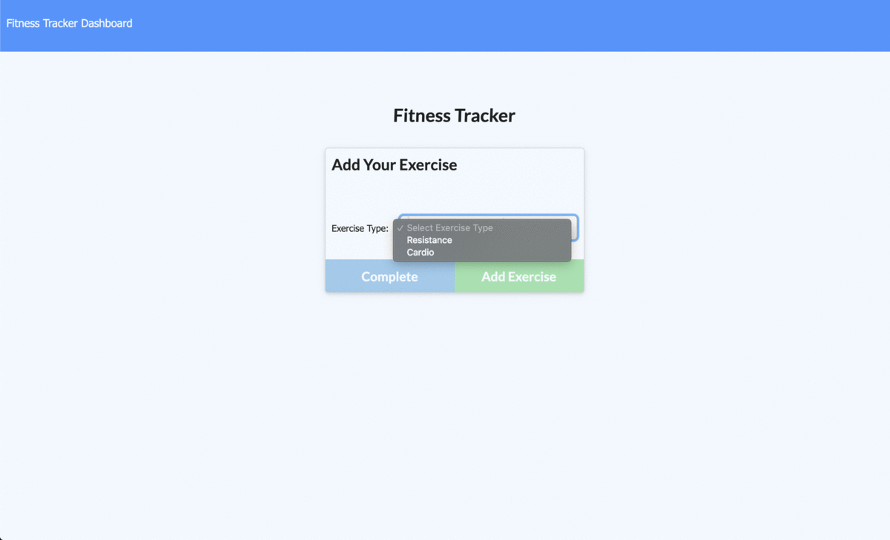

# Summer Shimmer Workout Tracker

## Description

Summer Shimmer Workout Tracker is a workout tracker. It allows users to view, create, and track daily workouts. Has the functionality to track most common types of exercises and shows stats that matter most.

Screenshot of application:

Deployed app is deployed to Heroku, [here](https://pure-springs-17284.herokuapp.com/)

To watch a screencast of the running application, please click here: [Screencast](https://drive.google.com/file/d/1nmzWkbLGhcErXZ4_es1NjAhzyCNhWeEh/view)

## Table of Contents

* [Installation](#Installation)
* [Usage](#Usage)
* [Contributing](#Contributing)
* [Tests](#Tests)
* [License](#License)
* [Questions](#Questions)

## Installation
To install, simply clone or download the repository. There are some NPM dependencies to keep in mind. 
run the following:
-- npm init
-- npm i
-- npm i mongoose
-- npm i express
-- npm i morgan (optional)

## Usage
The application allows users to track their workouts to see better results. Simply access the deployed app by clicking the Heroku link in the description above.

- When user loads the page, they have the option to create a new workout or continue with previous workout.
- User can:
-- add exercises to most recent workout plan
-- Add new exercises to a new workout plan
-- View the combined weight of multiple exercises from the past seven workouts on the stats page
-- View the total duration of each workout from the past seven workouts on the stats page
-- Have quick stats to last completed workout, including: date, duration, number of exercises, weights lifted, total number of reps, total number of sets

## Contributing
We love seeing community contribution to any opensource project! If you would like to contribute, please do.

## Tests
Unit tests included in test files. Make sure when making edits that all unit tests pass.

## License
This project is released under BSD 2 Clause opensource license:

https://opensource.org/licenses/BSD-2-Clause

## Questions
For more about my work, check out my Github profile: https://github.com/nard1n

If you have any questions and would like to chat, please feel free to send me an email directly to nardin.lachowski@gmail.com